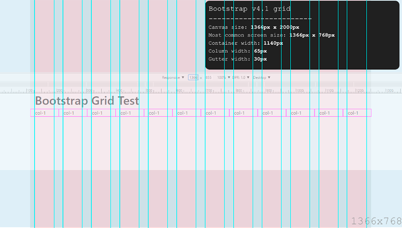

# Bootstrap v4.1 Grid no Photoshop
> Arquivo do Photoshop com o grid do Bootstrap.

Facilita a confecção de sites disponibilizando um grid de 12 colunas no padrão do [Bootstrap][1] versão 4.1, assim pode-se criar layouts para sites rapidamente.

## Instalação

Clique no botão de [download][2] ou clone esse repositório usando o comando `git clone git@github.com:rat/bootstrap-grid.git`

## Uso

Basta abrir o arquivo `Base Grid.psd` em seu Photoshop

## Contribuindo

1. Faça um fork!
2. Crie sua melhoria em um branch: `git checkout -b my-new-feature`
3. Commit suas mudanças: `git commit -am 'Adicionando nova funcionalidade'`
4. Envie ao branch: `git push origin my-new-feature`
5. Envie um pull request :D

## Changelog

#### Versão 0.0.1 *(16-06-2018)*

- Versão inicial.

## Créditos

Renato Tavares ([Github][3], [Twitter][4])

## Licença

[MIT License][5]

[1]: https://getbootstrap.com                                       "Bootstrap"
[2]: https://github.com/rat/bootstrap-grid/archive/master.zip       "Download arquivo PSD"
[3]: https://github.com/rat                                         "Github"
[4]: http://twitter.com/renatotavares                               "Twitter"
[5]: https://github.com/rat/bootstrap-grid/blob/master/LICENSE      "Licença MIT"
